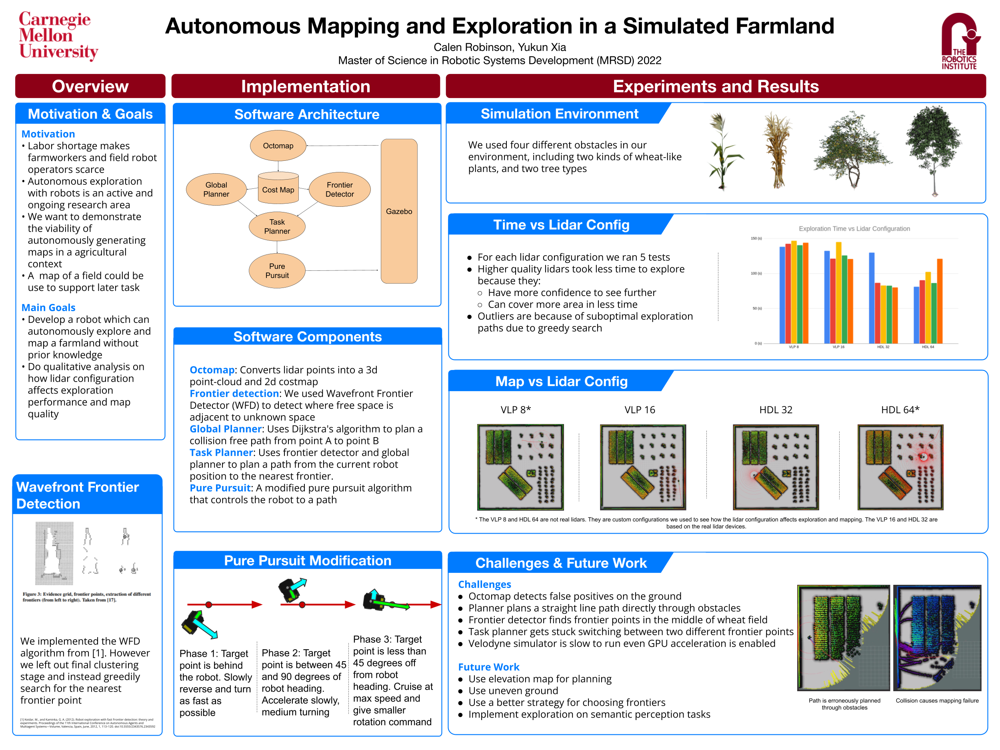

## Video

[](https://www.youtube.com/watch?v=yeF6xDfmzNk)
<figcaption align = "center">
  <b> Click the above image to watch the video </b>
</figcaption>

## Poster



## Prerequisites

- Install Husky packages
    - https://www.clearpathrobotics.com/assets/guides/kinetic/ros/Drive%20a%20Husky.html
- Install PCL
    - https://pointclouds.org/downloads/
    - `sudo apt install libpcl-dev`
- Install velodyne-simulator
    - `sudo apt install ros-noetic-velodyne-simulator`
- Install octomap packages
    - http://wiki.ros.org/octomap_mapping?distro=noetic
    - `sudo apt-get install ros-noetic-octomap ros-noetic-octomap-mapping`
    - `sudo apt-get install ros-noetic-octomap-rviz-plugins` for rviz visualization

## Instructions

- Run simulation via the following commands

```
catkin_make
source devel/setup.bash
roslaunch farmland_simulator husky_farmland.launch
```

- After simulation environment and rviz are fully loaded, run the following command to start exploration

```
rosrun farmland_planner farmland_planner_node
```


### Notes

* The official Husky document: https://www.clearpathrobotics.com/assets/guides/kinetic/husky/HuskyFrontiers.html#instructions
