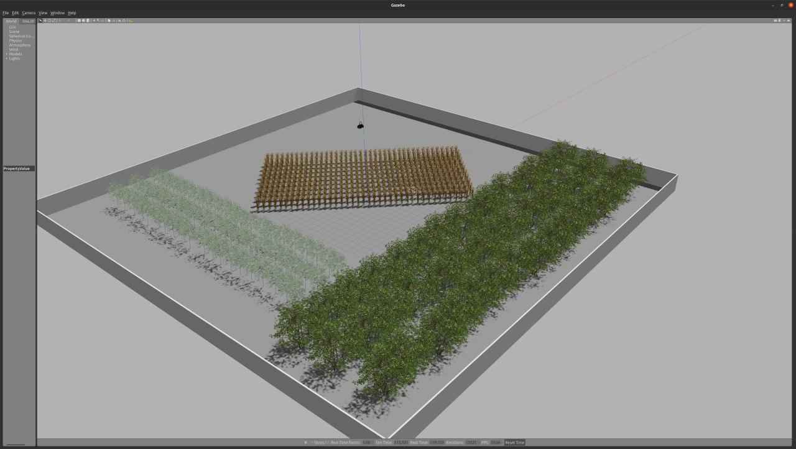

## Environments

- farmland_with_walls.world


## Prerequisites

- Install Husky packages
    - https://www.clearpathrobotics.com/assets/guides/kinetic/ros/Drive%20a%20Husky.html
- Install PCL
    - https://pointclouds.org/downloads/
    - `sudo apt install libpcl-dev`
- Install octomap packages
    - http://wiki.ros.org/octomap_mapping?distro=noetic
    - `sudo apt-get install ros-noetic-octomap ros-noetic-octomap-mapping`
    - `sudo apt-get install ros-noetic-octomap-rviz-plugins` for rviz visualization

## Instructions

- Run simulation via the following commands

```
catkin_make
source devel/setup.bash
roslaunch farmland_simulator husky_farmland.launch
```

- Move the robot by, for example,

```
rostopic pub /husky_velocity_controller/cmd_vel geometry_msgs/Twist "linear:
        x: 0.5
        y: 0.0
        z: 0.0
angular:
        x: 0.0
        y: 0.0
        z: 0.0" -r 10
```